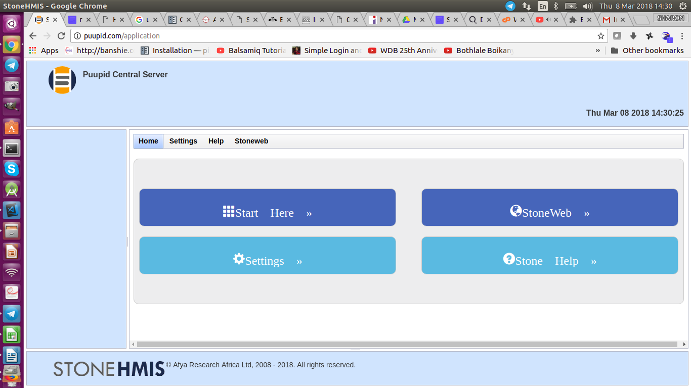

Home functionality
==================

The home functionality display looks like the emage shown below. 

1.1 Settings
++++++++++++
1.1.1 Stone user
----------------
**Register new User**

1. Click on the Home module on the left side of the page
2. Choose the settings button displayed on the current page
3. Click on the "Stone User" button
4. Click on the Register new user button
5. Fill in the details in the form as required
6. Click on the register button found at the end of the form

**Change password**

1. Click on the Home module on the left side of the page
2. Choose the settings button displayed on the current page
3. Click on the **Stone User** button
4. Choose the user whose mail you would want to change
5. Click on the Change password button
6. Input the current password and the new password and confirm the new password(new passowrd and confirm password should be the same)
7. Click on the change password button found at the end of the form

**Change email**

1. Click on the Home module on the left side of the page
2. Choose the settings button displayed on the current page
3. Click on the **Stone User** button
4. Choose the user whose mail you would want to change
5. Click on the Change email button
6. Modify the details in the form as required(Input the new email and confirm it)
7. Click on the change email button found at the end of the form

**List Users**

1. Click on the Home module on the left side of the page
2. Choose the settings tab on the top of the page
3. Click on the **Stone User** button
4. Click on the List user button
5. All the registered users should appear here in a display

**Retire User**

1. Click on the Home module on the left side of the page
2. Choose the settings tab on the top of the page
3. Click on the **Stone User** button
4. choose the Retire user button and click on it
5. Find the name of the user whom you want to Retire
6. Click on the name
7. Choose the **Retire user** item from the drop down menu at the top of this page
8. A message that confirms te user has been Retired is displayed

**Reactivate User**

1. Click on the Home module on the left side of the page
2. Choose the settings button displayed on the current page
3. Click on the **Stone User** button
4. Choose the Reactivate user button and click on it
5. Find the name of the user whom you want to Reactivate
6. Click on the name
7. A message that confirms te user has been Retired is displayed

1.2.2 Business Profile
----------------------

**View Business Profile**

1. Click on the Home module on the left side of the page
2. Choose the settings button displayed on the current page
3. Click on the Business profile button
4. Details of your registered company appears here. 

**Edit Business profile**

1. Click on the Home module on the left side of the page
2. Choose the settings button displayed on the current page
3. Click on the Business profile button
4. Details of your registered company appears here
5. SCroll down the page and click on the **edit profile** button 
6. Change the details as desired and required
7. Click on the **Save Business Profile** button at the bottom of the form

1.2 Help
++++++++
1.2.1 Version
-------------

This is where the version of stone building components are displayed

1. Click on the Home module on the left side of the page
2. Choose the Help button displayed on the current page
3. Click on the Version button
4. The versions of each component is displayed here

1.2.2 Documentation
-------------------

This is where the documentation detailing how stone is used and navigated 
through various modules is displayed.

1. Click on the Home module on the left side of the page
2. Choose the Help button displayed on the current page
3. Click on the Documentation button
4. The Documentation is displayed here

1.2.3 About StoneHMIS
---------------------

Display of a short overview of StoneHMIS

1. Click on the Home module on the left side of the page
2. Choose the Help button displayed on the current page and click on it
3. Click on the About StoneHMIS button 
4. A short description of the StoneHMIS is displayed here.

1.3 Stoneweb
++++++++++++

1.3.1 stonelink
---------------

This is made for patients and general users. It displays all the hospitals near a particular user
together with the information necessary about that particular hospital and ways of booking appointments

1. Click on the Home module on the left side of the page
2. Choose the Stoneweb button displayed on the current page
3. Click on the stonelink button 
4. The web application is diplayed here.

This is where all the hospitals and their related information is displayed

1.3.2 Stonechat
---------------

This is where the actual communication between the patients, specialits and any 
other medical professionals happens

1. Click on the Home module on the left side of the page
2. Choose the Stoneweb button displayed on the current page and click on it
3. Choose stonechat button and Click on it
4. The web application is diplayed here that allows communication among all the users

